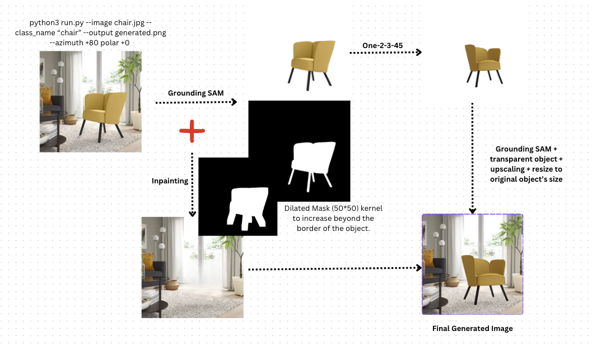
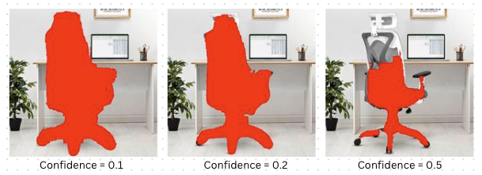
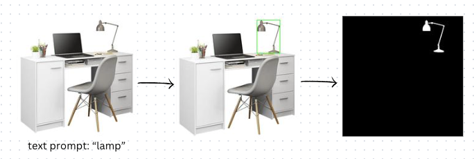
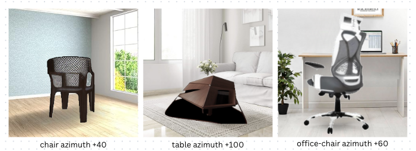
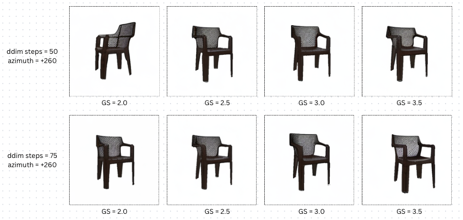
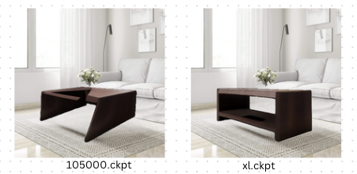
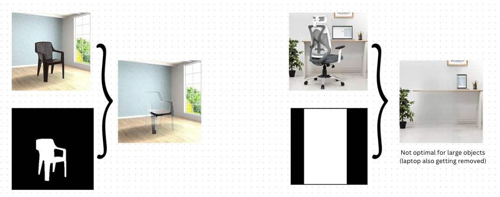
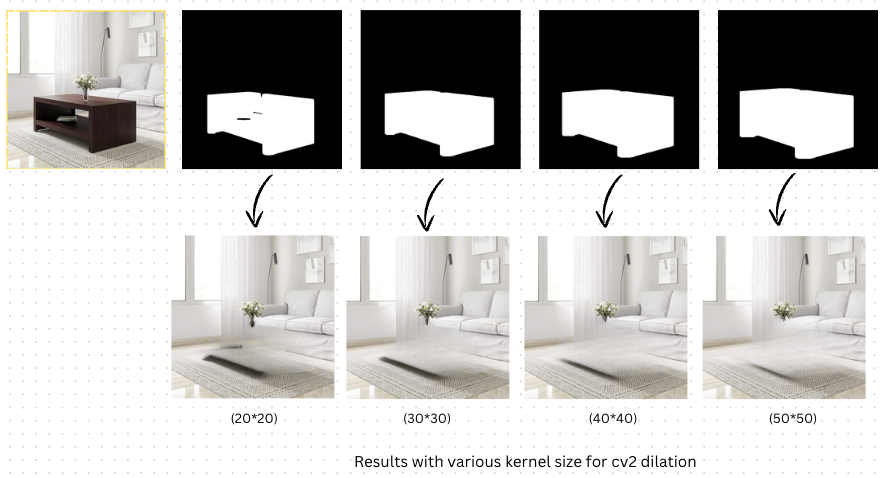
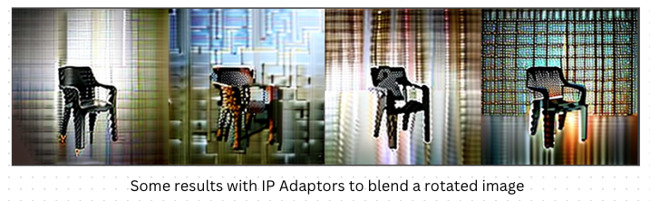
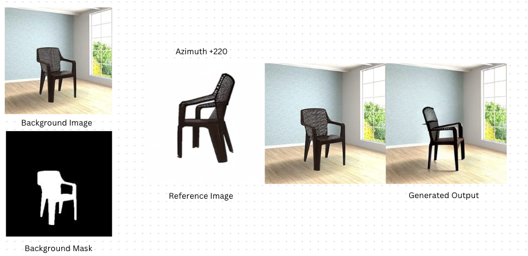

# MultiView-Avataar_task

<p align = "center"> Fig 1. Workflow</p>


<p align="center">

  Here is a description of the final workflow:

**Step 1**: Run Grounding Dino + SAM (Grounding SAM) on the image by using the test prompt to extract the mask of the object. <br>
**Step 2**: Highlight the object by making all the other pixels white. <br>
**Step 3**: Run Zero Shot one image to 3D using the given Azimuth & Polar values. <br>
**Step 4**: Enhance the object size from Step 3 using EDSR model. Run Grounding Dino + SAM to get segment the object and apply alpha channel to make the background transparent. <br>
**Step 5**: From Step 1, pad the binary mask by using cv2 dilations with kernel size 50*50. Extract the background image by running SD Inpainting on the original image using the binary mask. <br>
**Step 6**: Using results from Step 5 and Step 4, we use the coordinates of object in original image to place the rotated object. <br>
</p>

<h2>Getting Started (Inference)</h2>
Expected time cost per image: 120s on an NVIDIA RTX A6000.(If dockerized, would be lower) <br>
Hardware Requirements: GPU VRAM >= 27GB; RAM >= 30 GB
<br><br>
<details>
<summary>Step 1: Create and activate a conda environment and install the dependencies. </summary> 
  
```bash
conda create -n multiview python=3.9
conda activate multiview
cd MultiView-Avataar_task
pip install -r requirements.txt
```
</details>

<details>
<summary>Step 2: Download the checkpoint for one shot image to 3D. </summary> 

```bash
cd MultiView-Avataar_task
wget https://zero123.cs.columbia.edu/assets/zero123-xl.ckpt
```
</details>

<details>
<summary>Step 3: To perform only segmenatation, do not pass the azimuth and polar values. </summary> 

```bash
python3 run.py --image ./laptop.jpg --class_name "laptop" --output ./generated.png
```
</details>

<details>
<summary>Step 4: To perform image rotation, use the following command: </summary> 

```bash
python3 run.py --image ./laptop.jpg --class_name "laptop" --output ./generated.png --azimuth +80 --polar +0
```

</details>


<h2>Experimentation & Approach</h2>
<details>
<summary>Step 1: Segmentation </summary> 
   <p>
     <br><br>
     1. Started with ClipSeg as I had used it before. Tried different threshold values but the model wasnt performing well. 
     <br><br>
     
     <br><br>
     2. I had worked on SAM previously and saw that the model performs very well, but since it doesn't take in a text prompt, I did a little research and found that Grounding Dino + SAM will work out. Tried with SAM base, SAM large and SAM huge and finally chose SAM large as the optimal model for the task. This combination gave very good results, hence dint look for alternate methods. 
    <br><br>
     
     <br><br>
   </p>
      
</details>

<details>
<summary>Step 2: Image to 3D view </summary> 
   <p>
     <br><br>
     1. Used the base version of One shot single image to 3D model. The model worked well on the easier objects/angles but messed up angles that were harder to generate. Attaching a few images from the experiments at various angles with this attempt. 
     <br><br>
     
     <br><br>
     2. Ran this model also on various combinations of guidance scale (range 0.5 -> 4.0), angles (range 20 -> 340), and number of ddim sampling steps (range: 15 -> 100). Found that guidance scale 3.0 and ddim steps 75 gave the best results for three objects (laptop, chair and sofa). Higher steps caused more distortions and lower steps couldnt construct the object fully.
    <br><br>
     
     <br><br>
     3. Did a little more research and came across One-2-3-45 paper. I saw their preprocessing and the checkpoint they used was zero-123-xl checkpoint. Figured that removing the 'carvekit' preprocessing which was done in the new paper, was giving better results. Clearly shows that the xl model was better at generalizing at complex angles. 
    <br><br>
     
     <br><br>
     
   </p>
      
</details>

<details>
<summary>Step 3: SD Inpainting </summary> 
   <p>
     <br><br>
     1. Initially, approached this thinking that I can use the rotated object directly to blend it onto the source image, but the model always messed up the results. I tried methods by placing the rotated object on top the original object and used the mask to inpaint with a prompt "remove the behind object and blend the top object". Although I was aware that this was not what the model has learned to do, just gave it a shot and no wonder, it dint work. 
     <br><br>
     2. I remembered, we can remove objects/people using my friend's pixel mobile and thought why ca we do the same here i.e. get the background of the original image. This is when I went with extracting the background of the images using SD inpainting. There are couple of things I tried here with the masks:<br>
     a. Passed the strict binary mask predicted by SAM -> was still having issues getting the proper background.
     b. Used the entire bounding box as mask -> was removing surrounding objects also
     c. Padded the segmentation map using cv2 dilations. 
    <br><br>
     
     <br><br>
     <br><br>
     
     <br><br>
</details>

<details>
<summary>Step 4: Adding the rotated object to background </summary> 
   <p>
     <br><br>
     1. Read a couple of papers/went through a few hugging face spaces to see if any existing diffusion models can already do this, found some adaptors, but were not specifically generating the same object. 
     <br><br>
     
     <br><br>
     2. As I was going through the spaces, I came across any "Zero-shot Object-level Image Customization". I cloned the git repo, modified the code to take in source image, source mask as the original image mask, target image i.e. rotated image and target mask i.e. SAM output on rotated image. The method worked very randomly, tried to set the seed and enable shape control but the results were not consistent. Analysis: Read the paper again to found that the model doesnt perform very well yet on on the wild images and orientations. 
    <br><br>
     
     <br><br>
    3. Next attempt was when I thought we already have the bbox coordinates of the object in the original image and that we can place the newly rotated object directly at the center of those coordinates. But as I tried this, noticed that the generated view was of resolution (256,256), so segmenting directly and resizing to original object's size was resulting in poor quality of final result. 
     
</details>
<h2>Additional steps/methods taken</h2>
<p>
  1. While extracting the object before passing to to one-3D model, I noticed that DDIM model fails to build an accurate mesh for small objects, so I had to crop the object using a certain padding. <br><br>
  2. Explored poisson blending while placing the object onto the background to get smoother results, performed similar, hence dint go ahead with it. 
</p>
<h2>Further Improvements</h2>
<p>
  1. Image to 3D models can be much better if fintuned for this use case, since I see relevance in ecommerce, shopping, etc, applying the model for specific usecase might give better results. <br><br>
  2. If polar value is set, need to figure out a better method to blend the image onto the background. 
</p>

<h2>Conclusion & Insights</h2>
<p>
  


